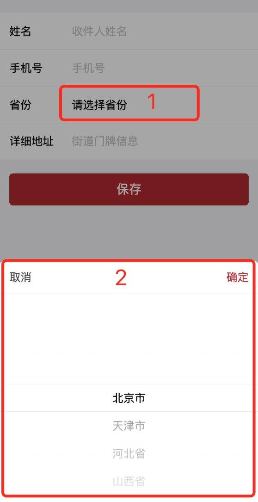

# 组件封装及通信

业务开发时碰到以下场景：用户点击省份选择时，需要先向服务器请求列表数据，再显示省份列表；如请求数据失败，提示错误信息，不显示省份列表。如下图显示：


但看界面非常容易，使用微信小程序picker控件就行，但是和业务结合以后发现并不可行，**picker控件点击后直接显示列表，无法插入数据请求等相关逻辑**。这里决定自行封装列表，然后在微信小程序JS文件写入相关业务逻辑，控制显示、消失、选中等相关逻辑。

### 组件封装
[组件官方介绍](https://developers.weixin.qq.com/miniprogram/dev/reference/api/Component.html)，这里不一一介绍了，需要了解的自行阅读，主要介绍我封装的[region-picker](https://github.com/z251257144/FireShop_wx/tree/master/components/region-picker)。

WXML文件
```xml
<view wx:if='{{flag}}'>
  <view class='wrap {{wrapAnimate}}' style='background:rgba(0,0,0,{{bgOpacity}});'></view>
  <view catchtap='hideFrame' class='frame-wrapper {{frameAnimate}}'>
    <view catchtap='catchNone' class='frame'>
      <!-- 标题 -->
      <view class='title-wrapper'>
        <view catchtap='hideFrame' style="padding: 0 30rpx 0 30rpx;">取消</view>
        <view catchtap='_confirmEvent' class="header-confirm">确定</view>
      </view>
      
      <picker-view indicator-style="height: 40px;" style="width: 100%; height: 300px;" value="{{value}}" bindchange="bindChange">
        <picker-view-column>
          <view wx:for="{{array}}" wx:key="index" style="line-height: 40px; text-align: center;">{{item}}</view>
        </picker-view-column>
      </picker-view>
    </view>
  </view>
</view>
```

WXSS文件
```css
/* components/region-picker/index.wxss */

.header-confirm {
  padding: 0 30rpx 0 30rpx;
  color: #B4282D;
}

.wrapAnimate{animation: wrapAnimate 0.5s ease-in-out forwards}
@keyframes wrapAnimate{
  0%{}
  100%{background:rgba(0,0,0,0.35);}
}
.wrapAnimateOut{animation: wrapAnimateOut 0.4s ease-in-out forwards}
@keyframes wrapAnimateOut{
  0%{background:rgba(0,0,0,0.35);}
  100%{background:rgba(0,0,0,0);}
}
.frameAnimate{animation: frameAnimate 0.5s ease forwards;}
@keyframes frameAnimate{
  0%{}
  100%{opacity: 1;top:0vh;}
}
.frameAnimateOut{animation: frameAnimateOut 0.4s ease forwards;}
@keyframes frameAnimateOut{
  0%{opacity: 1;top:0vh;}
  100%{opacity: 0;top:100vh;}
}
.frame-wrapper{
  position: fixed;
  height:100vh;
  width:100vw;
  z-index: 2;
  top: 50vh;
}

.frame{
  background: #fff;
  position: absolute;
  bottom: 0;
  width: 100%;
  /* padding: 5.9vw 5.9vw 0; */
  border-top-left-radius: 20rpx;
  border-top-right-radius: 20rpx;
  z-index: 3;
}

.title-wrapper{
  height: 96rpx;
  justify-content: space-between;
  color: #4a4a4a;
  border-bottom: 1rpx solid #F3F3F3;
  align-items: center;
  display: flex;
  flex-direction: row;
}

.flex{
  display: flex;
  align-items: center;
}

.wrap{
  position: fixed;
  z-index: 1;
  top: 0;
  left: 0;
  right: 0;
  bottom: 0;
}
```

JS文件
```js

Component({
  properties: {

  },

  data: {
    flag: false,
    wrapAnimate: 'wrapAnimate',
    bgOpacity: 0,
    frameAnimate: 'frameAnimate',
    value: [0],
    array: [],
    index: -1,
  },

  properties: {
    frameTitle: {
      type: String,
      value: '标题',
    }
  },

  methods: {
    show(array, index) {
      if (index == null || index < 0 ) {
        index = 0;
      }
      
      this.data.index = index;
      this.showFrame();
      this.setData({
        array:array,
        value: [index]
      });
    },

    showFrame() {
      this.setData({ flag: true, wrapAnimate: 'wrapAnimate', frameAnimate: 'frameAnimate' });
    },

    hideFrame() {
      const that = this;
      that.setData({ wrapAnimate: 'wrapAnimateOut', frameAnimate: 'frameAnimateOut' });
      setTimeout(() => {
        that.setData({ flag: false })
      }, 400)
    },

    catchNone() {
      //阻止冒泡
    },

    _confirmEvent() {
      this.hideFrame();
      // 点击事件带参传入父级
      this.triggerEvent('confirmSelect', this.data.index)
    },

    bindChange: function (e) {
      console.log('picker发送选择改变，携带值为', e.detail.value)
      this.data.index = e.detail.value;
    },
  }
})
```

JSON文件
```json
{
  "component": true,
  "usingComponents": {
    
  }
}
```
该组件对外提供了两个方法：

1、显示组件（show(array, index)），用于传入列表数据和索引。

2、确认列表选中索引（confirmSelect），用于数据回调。

传入数据有两种方式：第一种使用properties，在组件创建时传入，第二种是获取组件（selectComponent），再调用传入方法。

### 组件使用
在需要使用的界面WXML创建组件
```XML
<region-picker id="region-picker-city" bind:confirmSelect="confirmSelectCity">
</region-picker>
```

在需要使用的界面JS处理业务逻辑
```js
  // 选择城市函数
  changeCity: function (e) {
    var res = ["南京市", "苏州省", "无锡省", "常州省"]
    this.selectComponent('#region-picker-city').show(res, 1);
  },
  
  //确认城市选择
  confirmSelectCity: function (e) {
    this.setData({
      cityIndex: e.detail,
    });
  },
```

至此该控件的封装及使用已经写好了，以上控件使用是简化版的，实际业务是在数据请求成功以后再调用`changeCity`方法，并且方法内的res是实际数据，想查看具体代码的请移至我的[github工程FireShop_wx地址](https://github.com/z251257144/FireShop_wx)。

### 总结
1、封装组件便于我们自行控制代码逻辑，便于业务扩展，同时减少重复代码。

2、学习组件封装方法，具体阅读官方文档。

3、了解组件调用和数据回调方式。


